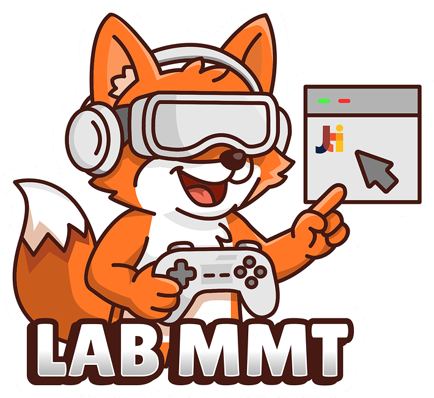

  
  <h1>Website Resmi Lab Multimedia MMT</h1>
  

    <strong>Pusat Inovasi Digital Politeknik Negeri Malang</strong>
  

  

    <a href="https://jtimultimedia.vercel.app/" target="_blank">Kunjungi Website</a> • 
    <a href="https://github.com/a6iyyu/mmt" target="_blank">Ingin Berkontribusi?</a>
  

   

## 🚀 Tentang Proyek Ini

Website ini dirancang bukan sekadar sebagai profil laboratorium biasa, melainkan sebagai **etalase digital** ("digital showcase") yang mempertemukan talenta terbaik dengan industri.

**Tujuan Utama:**

1.  **Menjual Potensi ("Showcasing Talent"):** Mempromosikan keahlian dosen dan mahasiswa di bidang Game Development, UI/UX, AR/VR, dan Multimedia.
2.  **Pusat Informasi:** Menyediakan jadwal pelatihan, sertifikasi, dan agenda riset terbaru.
3.  **Kolaborasi Industri:** Membuka pintu kerjasama antara Lab MMT dengan perusahaan atau instansi luar.

## ✨ Fitur Unggulan

- **Galeri Karya Interaktif:** Showcase portofolio mahasiswa (Game, App, Design) dengan filter kategori yang dinamis.
- **Direktori Talenta:** Profil lengkap Dosen & Mahasiswa berprestasi, lengkap dengan spesialisasi dan kontak profesional.
- **Jadwal Pelatihan:** Informasi kursus dan sertifikasi yang sedang dibuka.
- **Kategorisasi Bidang:** Navigasi mudah berdasarkan minat (Game Dev, UI/UX, 3D Art, dsb).

## 🛠️ Teknologi yang Digunakan

Proyek ini dibangun dengan _tech stack_ modern untuk memastikan performa tinggi, SEO yang baik, dan kemudahan pengembangan.

**Core:**

- [Next.js 15](https://nextjs.org/) (App Router)
- [React 19](https://react.dev/)
- [TypeScript](https://www.typescriptlang.org/)

**Styling & UI:**

- [Tailwind CSS v4](https://tailwindcss.com/)
- [Framer Motion](https://www.framer.com/motion/) (Animasi interaktif)
- [Lucide React](https://lucide.dev/) (Ikon)
- [Swiper](https://swiperjs.com/) (Carousel)

**Backend & Data:**

- [Prisma ORM](https://www.prisma.io/)
- [MySQL](https://www.mysql.com/) (Database)
- [TanStack Query](https://tanstack.com/query) (Data fetching & caching)

**Quality & Monitoring:**

- [Sentry](https://sentry.io/) (Error Tracking)
- [Vitest](https://vitest.dev/) (Unit Testing)
- [Playwright](https://playwright.dev/) (E2E Testing)

## 🎯 Harapan & Visi

Melalui platform ini, kami berharap **Lab Multimedia MMT** dapat:

1.  Lebih dikenal secara nasional maupun internasional sebagai pusat keunggulan multimedia.
2.  Meningkatkan daya serap lulusan di industri kreatif melalui portofolio yang terekspos dengan baik.
3.  Menjadi ekosistem yang menghubungkan akademisi, praktisi, dan mahasiswa dalam satu wadah inovasi.

---

  Dibangun dengan ❤️ oleh Tim Pengembang Lab MMT

